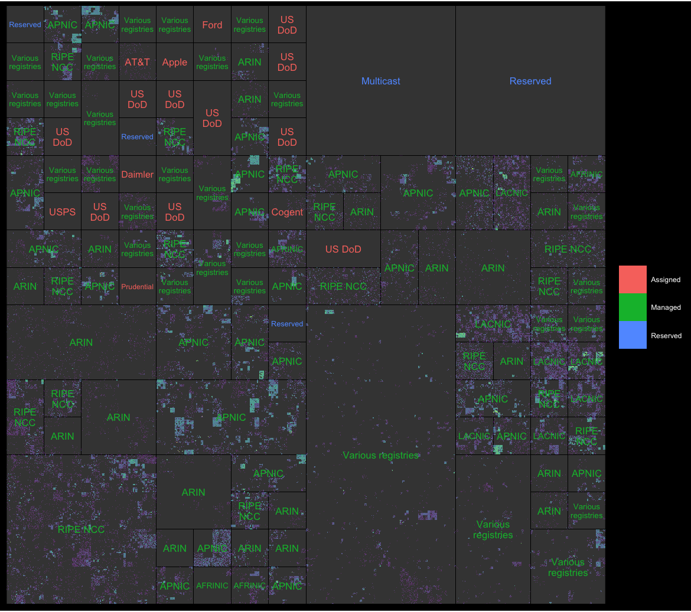

<!-- README.md is generated from README.Rmd. Please edit that file -->

```{r, include = FALSE}
knitr::opts_chunk$set(
  collapse = TRUE,
  comment = "#>",
  fig.path = "man/figures/README-",
  out.width = "100%"
)
```

# ggip

<!-- badges: start -->
[](https://www.tidyverse.org/lifecycle/#experimental)
[](https://CRAN.R-project.org/package=ggip)
[](https://github.com/davidchall/ggip/actions)
[](https://codecov.io/gh/davidchall/ggip?branch=master)
<!-- badges: end -->

**WARNING:** This package is in very early stages of development!

## Installation

You can install the development version from GitHub:

``` r
# install.packages("remotes")
remotes::install_github("davidchall/ggip")
```

## Quick start

`coord_ip()` forms the basis of any ggip plot.
It determines which region of address space is displayed and also the resolution
of the pixels in terms of network sizes.
It also translates `ip_address()` and `ip_network()` vectors into Cartesian coordinates
that can be used by ggplot2 layers.

With ggip, it is easy to quickly produce visualizations like this:


