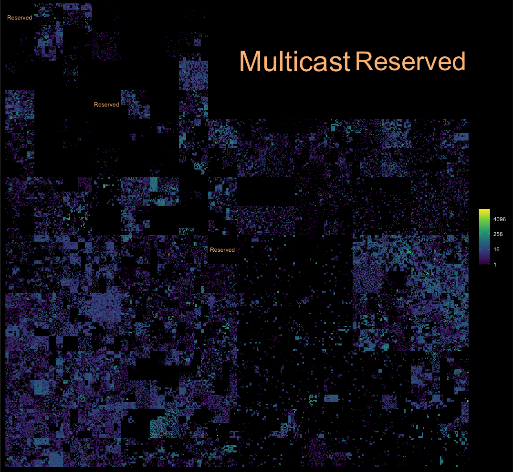

<!-- README.md is generated from README.Rmd. Please edit that file -->

# ggip <a href='https://davidchall.github.io/ggip/'></a>

<!-- badges: start -->

[](https://www.tidyverse.org/lifecycle/#experimental)
[](https://CRAN.R-project.org/package=ggip)
[](https://github.com/davidchall/ggip/actions)
[](https://codecov.io/gh/davidchall/ggip?branch=master)
<!-- badges: end -->

ggip is a [{ggplot2}](https://ggplot2.tidyverse.org) extension for
visualizing IP addresses and networks stored in
[{ipaddress}](https://davidchall.github.io/ipaddress/) vectors.

Here are some of the key features:

  - IP data mapped to 2D plane by a **unified coordinate system**
  - Compatible with **existing ggplot2 layers**
  - Custom **IP-specific layers** for common use cases
  - Full support for both **IPv4 and IPv6** address spaces

## Installation

You can install the released version of ggip from
[CRAN](https://CRAN.R-project.org) with:

``` r
install.packages("ggip")
```

Or you can install the development version from GitHub:

``` r
# install.packages("remotes")
remotes::install_github("davidchall/ggip")
```

## Usage

Plotting with {ggip} follows most of the conventions set by
[{ggplot2}](https://ggplot2.tidyverse.org). A major difference is that
`coord_ip()` is required to map IP data to the 2D grid (addresses to
points and networks to rectangles). Learn more in `vignette("ggip")`.

Here’s a quick showcase of what’s possible:

``` r
library(tidyverse)
library(ggfittext)
library(ggip)

ggplot(ip_data) +
  stat_summary_address(aes(ip = address)) +
  geom_hilbert_outline(color = "grey80") +
  geom_fit_text(
    aes(
      xmin = network$xmin, xmax = network$xmax,
      ymin = network$ymin, ymax = network$ymax,
      label = label
    ),
    data = iana_ipv4 %>% filter(allocation == "Reserved"),
    color = "#fdc086", grow = TRUE
  ) +
  scale_fill_viridis_c(name = NULL, trans = "log2", na.value = "black") +
  coord_ip(pixel_prefix = 20) +
  theme_ip_dark()
#> Warning: Transformation introduced infinite values in discrete y-axis
```


