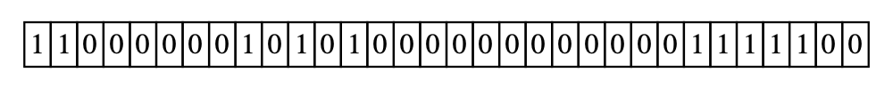
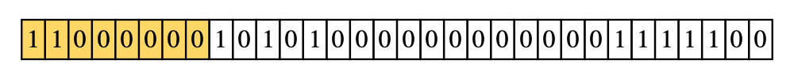
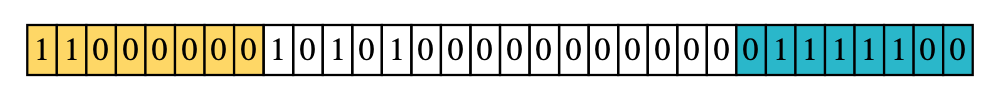

```{r, include = FALSE}
knitr::opts_chunk$set(
  collapse = TRUE,
  comment = "#>",
  echo = FALSE,
  message = FALSE
)
```

```{r setup, warning=FALSE}
library(ggip)
```

*This vignette assumes an understanding of IP addresses and networks.*
*Please consult `vignette("ipaddress-classes", "ipaddress")` for a very basic introduction.*

Data visualization of the IP address space is challenging because there are so many unique addresses (approximately 4.3 billion for IPv4 and $3.8 \times 10^{38}$ for IPv6).
Owing to the hierarchical nature of address space, we must plot the addresses on a discrete scale (not a continuous scale).
It's simply not possible to display (or interpret) such a large number of discrete levels simultaneously.

There are a few actions we can take to improve the situation:

1. Visualize a reduced number of discrete levels by:
    a. Showing only a subnetwork of the full address space (i.e. filtering leading bits)
    b. Limiting the resolution by summarizing data within networks (i.e. neglecting trailing bits)
2. Transform the one-dimensional address space onto the two-dimensional plane

These are handled by the `canvas_network`, `pixel_prefix` and `curve` arguments of `coord_ip()`, respectively.
This vignette describes these actions in more detail.


## Reducing visualized information

As an example, consider the 32-bit representation of the IPv4 address `192.168.0.124`.
If we wanted to visualize this single address within the full context of the IPv4 address space, we'd need to simultaneously display $2^{32}$ discrete levels (roughly 4.3 billion).

```{r, out.width="100%"}

```

To reduce the visualized information, we could only show a subnetwork of the full address space.
In our example, we could only display the `192.0.0.0/8` network.
This would effectively filter addresses where the leading 8 bits match the specified network, thereby reducing the number of discrete levels to $2^{24}$ (roughly 16.8 million).

```{r, out.width="100%"}

```

Alternatively, we could make each discrete level represent a network of addresses.
To do this, we'd need to use a summary function to reduce the network data to a single value.
In our example, we could make each discrete level represent a network with a prefix length of 24.
This would effectively neglect the trailing 8 bits of the 32-bit address, thereby further reducing the number of discrete levels to $2^{16}$ (65,536).

```{r, out.width="100%"}

```

These two techniques become even more important in the IPv6 address space, which uses 128-bit addresses.

**Note:** To prevent accidentally plotting an unreasonably large number of discrete levels, ggip limits the number of plotted bits to 24.
This means the `coord_ip()` arguments must satisfy:

```
pixel_prefix - prefix_length(canvas_prefix) <= 24
```

## Space-filling curves

Inspired by [an xkcd comic](https://xkcd.com/195/) originally published in December 2006, we use a space-filling curve to map IP data (one-dimensional) to Cartesian coordinates (two-dimensional).
This means our discrete levels become represented by pixels.
Two curves are commonly chosen for this task: the Hilbert curve and the Morton curve (also known as the Z curve).
Compared to other space-filling curves, these are advantageous because they preserve locality (i.e. subnetworks remain close together).

The curve order represents how nested the curve is and therefore determines how many data points can be visualized.
Conversely, choosing the number of plotted bits (see above) determines the order of the curve.
Since space-filling curves are fractal, increasing the curve order effectively improves the image resolution (plotted networks remain in the same overall location).

```{r plot_func}
ordinal_suffix <- function(x) {
    suffix <- c("st", "nd", "rd", rep("th", 17))
    suffix[((x-1) %% 10 + 1) + 10*(((x %% 100) %/% 10) == 1)]
}

plot_curve <- function(curve, curve_order) {
  pixel_prefix <- 32L
  canvas_prefix <- as.integer(pixel_prefix - (2 * curve_order))
  canvas_network <- ip_network(ip_address("0.0.0.0"), canvas_prefix)
  n_pixels <- 2^curve_order
  
  ggplot(data.frame(address = seq(canvas_network))) +
    geom_path(aes(address$x, address$y)) +
    coord_ip(
      canvas_network = canvas_network,
      pixel_prefix = pixel_prefix,
      curve = curve,
      expand = TRUE
    ) +
    theme_ip_light() +
    labs(title = paste0(
      curve_order, ordinal_suffix(curve_order),
      " order (", n_pixels, "x", n_pixels, " grid)"
    ))
}
```

### Hilbert curve

IP data is most commonly displayed on a Hilbert curve because it has optimal locality preservation.

This curve starts in the top-left corner and ends in the top-right corner.

```{r hilbert, fig.show="hold", out.width="30%"}
plot_curve("hilbert", 2)
plot_curve("hilbert", 3)
plot_curve("hilbert", 4)
```


### Morton curve

The Morton curve technically offers slightly poorer locality preservation than the Hilbert curve.
However, the discontinuous jumps in the curve actually correspond to crossing IP network boundaries.
In this sense, the Morton curve is a more natural representation of the IP network structure.
For example, the start and end addresses of a network are always located diagonally across from each other.

This curve starts in the top-left corner and ends in the bottom-right corner.

```{r morton, fig.show="hold", out.width="30%"}
plot_curve("morton", 2)
plot_curve("morton", 3)
plot_curve("morton", 4)
```


## Putting it all together

Finally, let's consider a specific example.

```{r, echo=TRUE, eval=FALSE}
coord_ip(
  canvas_prefix = ip_network("0.0.0.0/0"),
  pixel_prefix = 4,
  curve = "hilbert"
)
```

This coordinate system will use a 2nd order Hilbert curve to visualize the entire IPv4 address space, where each vertex represents a `/4` network.

```{r, fig.align="center", fig.asp=1, fig.width=5}
curve_order <- 2
pixel_prefix <- 2 * curve_order
vertices <- subnets(ip_network("0.0.0.0/0"), new_prefix = pixel_prefix)

data <- data.frame(ip = network_address(vertices), label = as.character(vertices))
nudge <- c(1, 0, 0, 1, 1, 1, 0, 0, 0, 0, -1, -1, -1, 0, 0, -1)

ggplot(data, aes(ip$x, ip$y)) +
  geom_path() +
  geom_label(aes(label = label), nudge_x = 0.2 * nudge) +
  coord_ip(pixel_prefix = pixel_prefix, expand = TRUE) +
  theme_ip_light() +
  labs(title = paste0("Hilbert curve: ", curve_order, ordinal_suffix(curve_order), " order"))
```

